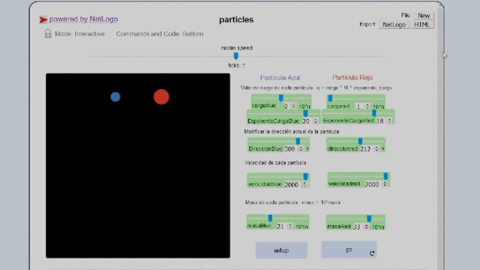

# Sistema de partículas.

___

En esta práctica se ha utilizado Netlogo para implementar un sistema multiagente que simula un sistema de dos partículas cargadas eléctricamente.

## Instrucciones de uso

* setup : inicializa el sistema de partículas.
* go : inicia la ejecución de la simulación.
* Carga eléctrica: el valor de carga de la partícula es m*10^e
  * cargablue / cargared : valor de la mantisa de la carga.
  * exponentecargablue / exponentecargared : valor del exponenete
* direccionblue / direccionred : permite cambiar la dirección actual de la partícula por la que se establece en el *slider*. Este slider no muestra la dirección actual sino la que se quiere establecer al actualizar su valor.
* velocidadblue / velocidadred : velocidad de la partícula multiplicado por 1000.
* masablue / masared : valor del exponente de la masa de la partícula. La masa de la partícula es 1eM, donde M es el exponente. El valor de la masa permite también controlar su tamaño.
